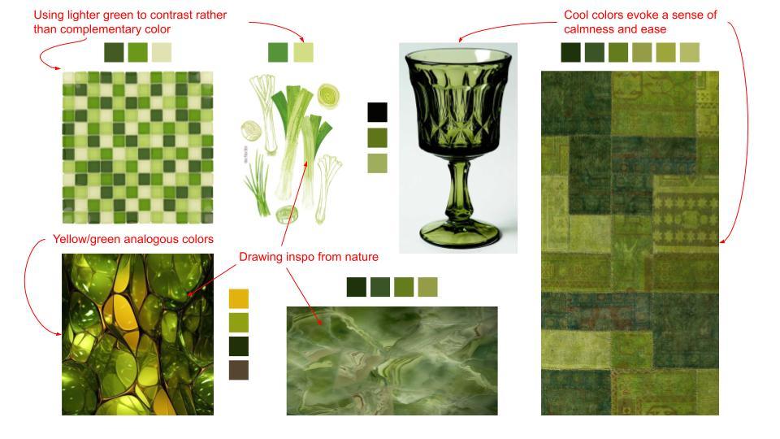
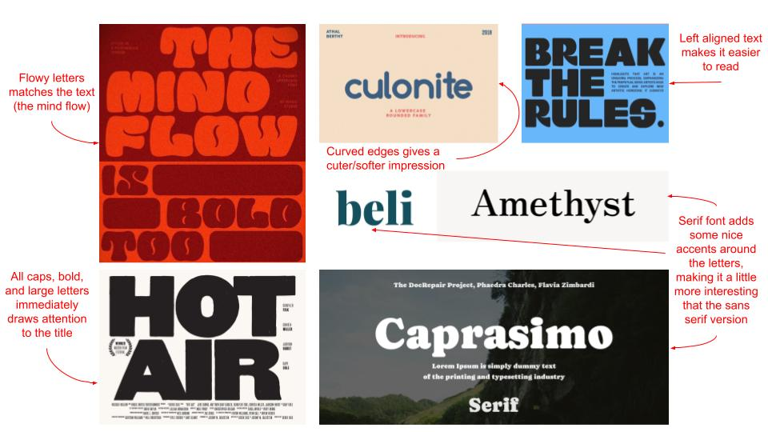

# Visual Design Study

## Color

## Typography

### Overall Takeaways

Color: The green colors evoke a sense of calmness and pairs well with other shades of green. In the glass vase (bottom left image), the yellow also pairs well with it, which is likely since they are analogous colors. Sticking within the same color but slowly integrating different shades like the patchwork quilt (right image) makes the image cohesive but not boring.

Typography: “The Mind Flow” poster font evokes a sense of freedom/openness because the font is flowy and big, but would be hard for a generic website font. The Serif fonts add a layer of complexity to the relatively simple fonts, which makes them both interesting and practical. The use of bold in the “Break the Rules” poster adds contrast between the main and secondary text.
